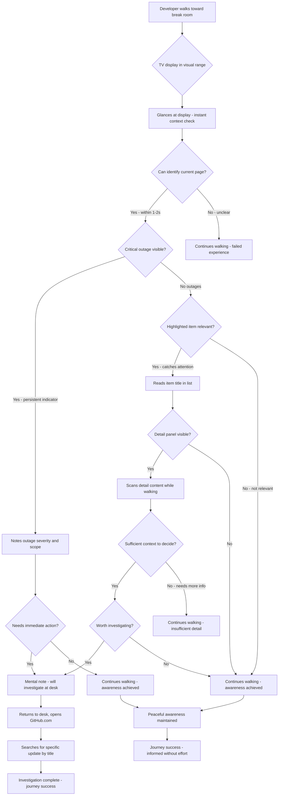
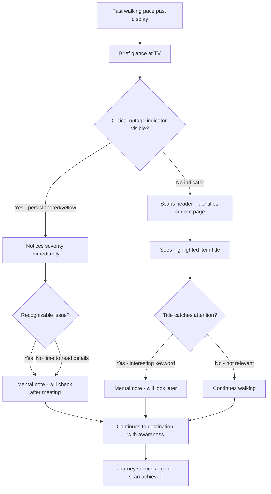
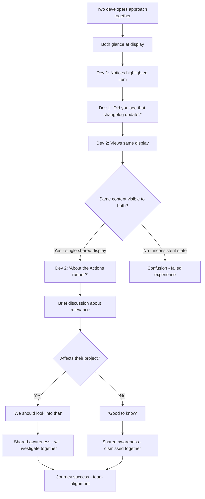

# UX Design Specification github-latest-dashboard

**Author:** Shane
**Date:** 2026-03-02

---

## Executive Summary

### Project Vision

GitHub Updates Office Dashboard is a passive awareness system for development teams, displayed on an office TV in high-traffic areas. It transforms GitHub platform monitoring from an active chore into ambient team knowledge. The dashboard catches developers' attention during coffee breaks or walk-bys, triggering deeper investigation at their desks when something relevant appears. The design philosophy emphasizes zero-friction consumption, shared team awareness, and 24/7 reliability through simple infrastructure (Raspberry Pi kiosk).

### Target Users

**Primary Users:** Software engineers and technical staff who work with GitHub daily

**Usage Patterns:**
- **Coffee break glancers:** Users who linger briefly near the TV, scanning for interesting updates
- **Quick passers:** Users moving through who may pause if something catches their eye
- **Viewing distance:** 10-15 feet from TV display
- **Frequency:** Multiple walk-bys throughout the day

**User Needs:**
- Passive awareness without notification noise or active checking friction
- Shared team visibility of GitHub ecosystem changes
- Ability to quickly spot critical issues (especially active outages)
- Readable, scannable information at TV viewing distance

### Key Design Challenges

**C1: Cross-Page Outage Visibility**
When evolving to carousel architecture, critical GitHub status incidents (active outages) must remain visible even when the Status page isn't currently displayed. Users shouldn't miss critical service disruptions due to page rotation timing.

**C2: Transition from Simultaneous to Sequential**
Moving from three-column simultaneous view to page-based carousel requires careful UX design to maintain the "glanceability" that makes the dashboard effective. Page rotation timing and visual transitions must feel natural for both coffee break glancers and quick passers.

**C3: Maintaining GitHub Authenticity**
All design evolution must preserve the existing GitHub Primer design language, color palette, and visual patterns that users already love. The dashboard represents GitHub and must feel like GitHub.

**C4: Readability at Distance**
Typography, contrast, and layout must remain optimized for 10-15 foot viewing distance throughout all design iterations, balancing information density with legibility.

### Design Opportunities

**O1: Enhanced Information Depth**
Carousel architecture with split-view detail panels enables deeper content engagement while maintaining passive awareness. Users can absorb more context during coffee break glances without sacrificing the quick-scan capability.

**O2: Progressive Disclosure**
Item-level highlighting and detail views create a natural information hierarchy - overview in the list, depth in the detail panel. This serves both quick passers (scan headlines) and lingerers (read details).

**O3: Persistent Progress Indicators**
The loading bar animation users love can evolve into dual-purpose: page rotation progress AND data refresh status, providing ambient feedback about both rotation state and content freshness.

**O4: Adaptive Prominence**
Critical status incidents can use visual prominence (persistent indicators, color-coded alerts) to break through the rotation cycle, ensuring high-priority information reaches users regardless of timing.

## Core User Experience

### Defining Experience

The core user experience centers on **passive ambient scanning** during walk-bys in high-traffic office areas. Users glance at the dashboard from 10-15 feet away, quickly scanning for GitHub platform updates (blog posts, changelog entries, status incidents) that are relevant to their daily work.

**MVP Experience (Current):**
Users scan three simultaneous columns (Blog | Changelog | Status), absorbing headlines and timestamps at a glance. When something catches their attention, they return to their desk to investigate further via GitHub directly.

**Carousel Evolution (Post-MVP Phase 1):**
Users encounter a single-page view with split-view layout: item list on left (headlines overview) and expanded detail panel on right (featured content). The dashboard rotates through pages (Blog → Changelog → Status) while highlighting individual items within each page. Users can quick-scan the list or pause to read detail content during coffee breaks.

**Critical Success Action:**
The make-or-break interaction is **spotting relevant information and deciding to investigate**. Users must effortlessly notice updates that matter to them, triggering the transition from passive awareness to active engagement at their desk.

### Platform Strategy

**Primary Platform:** Web-based display running in Chromium browser on Raspberry Pi 3B kiosk

**Platform Characteristics:**
- **Display Type:** Passive visual display with zero user interaction
- **Resolution:** 1920x1080 TV display, optimized for 10-15 foot viewing distance
- **Deployment:** 24/7 always-on kiosk mode with potential automatic on/off during business hours
- **Network Dependency:** Requires WiFi for API updates; gracefully displays cached content during network interruptions with visible status indication
- **Interaction Model:** No touch, mouse, or keyboard input - purely passive information consumption

**Platform Constraints:**
- Raspberry Pi 3B hardware limitations (1GB RAM, quad-core ARM)
- Chromium 84 browser compatibility requirements
- Fixed viewing context (TV display in specific location)
- No progressive enhancement needed (always-on assumption)

### Effortless Interactions

**E1: Spotting Critical Outages**
Users must immediately notice active GitHub status incidents regardless of which page is currently displayed in the carousel rotation. Critical service disruptions cannot be hidden by timing.

**E2: Understanding Current Context**
When walking by mid-rotation, users instantly recognize which page they're viewing (Blog, Changelog, or Status) without cognitive effort or visual search.

**E3: Reading Featured Content**
The highlighted item and its detail panel feel naturally prominent. Users don't search for "what am I supposed to look at" - the visual hierarchy makes it obvious.

**E4: Comfortable Timing**
Both page rotation and item-level highlighting operate at an unhurried pace that accommodates coffee break glancers while maintaining engagement for quick passers. No one feels rushed or left behind by the rotation speed.

### Critical Success Moments

**M1: The Glance Hook (2-3 Second Context)**
User walks by mid-rotation and within 2-3 seconds understands what page they're viewing, what item is featured in the detail view, and whether anything demands their attention. Failure: User confusion about current context or missing relevant updates.

**M2: The Outage Alert (Cross-Page Visibility)**
User spots a critical GitHub outage or incident regardless of which page is currently showing in rotation. Failure: User misses critical service disruption because Status page wasn't displayed during their walk-by.

**M3: The Investigation Decision (Detail Sufficiency)**
User reads sufficient context from the detail panel to decide "this is worth investigating at my desk" vs "not relevant, keep walking." Failure: Insufficient detail causes users to ignore relevant updates or waste time investigating irrelevant ones.

**M4: The Rotation Feel (Natural Rhythm)**
Page transitions and item highlighting feel natural and unhurried. Coffee break glancers don't feel rushed; quick passers don't find it distracting or jumpy. Failure: Rotation timing feels too fast, too slow, or jarring.

**M5: The Shared Discovery (Team Awareness)**
Two developers walking by simultaneously see the same information and can reference it in conversation ("Did you see that changelog update about Actions?"). Failure: Inconsistent visibility breaks shared team awareness.

### Experience Principles

**P1: Passive First, Always**
Every design decision must preserve zero-effort consumption. Users should absorb information through presence alone, never requiring active engagement, interaction, or cognitive load to understand what's displayed.

**P2: Distance-Optimized Clarity**
All visual elements (typography, color, contrast, layout) must be instantly readable and comprehensible from 10-15 feet away. Information hierarchy should be obvious at a glance, not requiring close inspection.

**P3: Critical Information Transcends Rotation**
Active GitHub outages and critical incidents must break through the page rotation cycle with persistent visibility. Life-critical information cannot be hidden by timing.

**P4: GitHub Authenticity Above All**
Preserve the existing GitHub Primer design language, color palette, and visual patterns without deviation. The dashboard represents GitHub and must feel authentically GitHub, not a custom interpretation.

**P5: Unhurried Natural Rhythm**
Page rotation and item highlighting timing must accommodate coffee break glancers while not feeling sluggish to quick passers. Transitions should feel organic and natural, never rushed or jarring.

**P6: Progressive Context Disclosure**
Split-view architecture creates natural information layers: headlines for quick passers, details for lingerers. Users self-select their engagement depth based on available time and interest.

## Desired Emotional Response

### Primary Emotional Goals

**Peaceful Passive Awareness**
The defining emotional experience is calm, effortless information consumption without anxiety or obligation. Users feel informed about GitHub ecosystem updates without the stress of active monitoring, notification fatigue, or guilt about "not checking." The dashboard creates ambient awareness that feels natural and non-intrusive.

**Calm Confidence**
Users trust they won't miss critical information while maintaining a peaceful relationship with staying informed. The dashboard provides reassurance through its persistent presence and reliable updates, eliminating worry about being out of the loop.

**Optional Engagement**
Users feel empowered by choice - they can glance or not glance, investigate or keep walking. There's no pressure, no obligations, and no guilt. Engagement happens naturally when relevance aligns with availability.

### Emotional Journey Mapping

**First Discovery (Installation Day)**
- **Relief:** Monitoring is now automatic; no more manual checking burden
- **Confidence:** Trust that critical updates won't slip through the cracks
- **Curiosity:** Interest in what information appears on the display

**During Walk-By (Core Moment)**
- **Informed Without Effort:** "I know what's happening" through passive observation
- **No Anxiety/Pressure:** Unlike email where unread items feel like obligations, the dashboard imposes no demands
- **Optional Engagement:** Freedom to look or not look without guilt either way
- **Peaceful Presence:** The dashboard is "just there" providing value through existence alone

**Spotting Something Relevant**
- **Empowered:** "I caught this early" - proactive awareness rather than reactive discovery
- **Satisfied:** "The system works" - validation of the passive monitoring approach
- **Motivated:** Natural transition from passive awareness to active investigation

**When Nothing Critical is Happening**
- **Reassured:** "All quiet, all good" - absence of incidents provides peace of mind
- **Calm:** Routine updates feel informative rather than urgent, creating steady ambient awareness

**When There IS a Critical Outage**
- **Alert But Not Panicked:** Confident awareness rather than alarm - "I see the problem, I can act on it"
- **Grateful:** "Glad I saw this" - appreciation for early notification without intrusive alerts
- **In Control:** Immediate awareness enables proactive response rather than reactive scrambling

### Micro-Emotions

**Confidence Over Confusion**
Users instantly understand what they're viewing (current page, featured content) without cognitive effort or visual search. Clarity creates comfort.

**Trust Over Skepticism**
Users believe the dashboard shows current, accurate information. Visible refresh indicators and timestamps reinforce reliability without demanding attention.

**Calm Over Overwhelm**
Information density feels manageable and scannable. Whitespace, readable typography, and controlled layout prevent visual chaos or cognitive overload.

**Awareness Over Anxiety**
Critical issues are clearly visible but not panic-inducing. Color-coded status communicates severity without alarmist styling or aggressive alerts.

**Belonging Over Isolation**
Shared team visibility creates connection and common context. Seeing the same information simultaneously enables natural conversation and team alignment.

**Satisfaction Over Frustration**
When something catches attention, the detail panel provides sufficient context for informed decision-making without requiring additional research to understand relevance.

### Design Implications

**To Create "Peaceful Passive Awareness":**

**Unhurried Timing**
- Page rotation: 30 seconds (default) - accommodates coffee break glancers without feeling sluggish
- Item highlighting: 8 seconds (default) - comfortable reading pace without pressure
- Smooth transitions (500ms page, 200ms highlight) - organic rhythm, never jarring

**Effortless Scanning**
- High contrast typography (WCAG AA compliance) for 10-15 foot readability
- Clear visual hierarchy - instant understanding of page context and featured item
- GitHub Primer colors - familiar, trustworthy styling

**Ambient Status Feedback**
- Progress indicators show rotation state and refresh timing
- Subtle "last updated" timestamp provides recency confidence
- Network status indication during WiFi interruptions

**Calm Critical Alerts**
- Persistent cross-page outage indicators (visible regardless of rotation)
- Color-coded severity (GitHub Primer red/yellow) without aggressive styling
- Information-first presentation, not alarm-first

**Trust Through Consistency**
- GitHub-authentic design creates familiarity and reliability
- Predictable rotation patterns enable mental models
- Persistent state (everyone sees same view) reinforces shared reality

**Sufficient Detail Without Overwhelm**
- Split-view provides overview (list) and depth (detail panel) simultaneously
- Progressive disclosure - users choose engagement level naturally
- Detail panel formatted for TV viewing distance with comfortable spacing

### Emotional Design Principles

**ED1: Ambient, Never Demanding**
All design choices prioritize non-intrusive presence. The dashboard should provide value through passive availability, never demanding attention or creating obligation.

**ED2: Calm Critical Communication**
Even urgent information (outages, incidents) should communicate importance without inducing panic. Use clear, confident presentation over alarmist styling.

**ED3: Trust Through Transparency**
Make system state visible (refresh timing, network status, rotation progress) to build user confidence without creating noise. Users trust what they can observe.

**ED4: Respect Attention Economics**
Users give limited attention during walk-bys. Every visual element must justify its presence and contribute to instant comprehension or peaceful awareness.

**ED5: Familiarity Breeds Confidence**
Preserve GitHub Primer design patterns throughout all evolution. Visual familiarity creates emotional comfort and reduces cognitive load.

**ED6: Choice Over Obligation**
Never make users feel they "should have noticed" something. The dashboard serves users; users don't serve the dashboard. Engagement is always optional.

## UX Pattern Analysis & Inspiration

### Inspiring Products Analysis

**Primary Inspiration: GitHub Primer Design System**

GitHub's design language serves as the singular inspiration source for this dashboard. The current implementation successfully captures GitHub's aesthetic, and all evolution must preserve this authenticity.

**What Makes GitHub's Design Work:**
- **Dark Theme Elegance:** Background (#0d1117) creates calm, focused environment without visual competition
- **Purposeful Color:** Strategic use of accent colors (blue links #58a6ff, status colors, badges) - never overused
- **Readable Hierarchy:** Clear typography with intentional font weights (600 for emphasis, 400 for body) and deliberate spacing
- **Border-Based Structure:** Subtle borders (#21262d) provide organization without heavy visual weight
- **Minimal Effects:** No shadows, gradients, or heavy effects - clean and performance-friendly
- **Systematic Spacing:** Consistent, predictable spacing creates visual rhythm and scannability

**Current Dashboard Success Patterns:**

**Item Styling Within Columns:**
- Clean list items with prominent title hierarchy
- Subtle background states for visual feedback
- Muted metadata color (#7d8590) keeps focus on headlines
- Adequate vertical spacing prevents crowding while maximizing information density
- Link color (#58a6ff) maintains readability at 10-15 foot viewing distance

**Header Treatment:**
- Bold uppercase section titles (BLOG, CHANGELOG, STATUS)
- Letter-spacing (1px) creates that recognizable GitHub header aesthetic
- Color-coded by section providing instant context
- Clear visual separation between header and content

**Color Balance and Contrast:**
- High contrast text (#c9d1d9) on dark background ensures distance readability
- Status colors (green/yellow/red) provide immediate, familiar communication
- Border color (#21262d) structures content without visual heaviness
- Accent colors used strategically, never overwhelming the clean aesthetic

### Transferable UX Patterns

**P1: GitHub's Selected Item State → Carousel Highlighted Item**
Adapt GitHub's "selected item" visual treatment for the currently featured item in the carousel. Use slightly brighter background, bold text weight, and optional subtle left border accent (pattern GitHub uses in navigation lists).

**P2: Progressive Disclosure Model → Split-View Architecture**
GitHub shows previews in lists with full content on interaction. Adapt this pattern for passive display: headlines in left list provide overview, detail panel on right shows depth. Same information architecture, optimized for passive consumption.

**P3: Badge and Label System → Content Emphasis**
GitHub's label system (UPDATED, NEW FEATURE, etc.) with color-coded badges can emphasize recent or critical items in the dashboard. Maintain GitHub's exact badge styling and color choices.

**P4: Status Page Design → Incident Display**
GitHub's own status page (githubstatus.com) provides the template for displaying incidents. Operational (green indicator), Degraded (yellow), Major outage (red) with consistent iconography and color treatment.

**P5: Subtle Transitions → Page Rotation**
GitHub uses gentle fade transitions between states. Apply this timing and easing to page transitions (fade, ~300-500ms) to maintain the calm, unhurried aesthetic.

**P6: Sidebar Panel Pattern → Detail View**
GitHub's sidebar panels (file viewers, PR details) provide inspiration for the detail panel layout. Maintain similar padding, typography hierarchy, and content structure.

### Anti-Patterns to Avoid

**Visual Design Anti-Patterns:**
- **Custom Color Palettes:** Any deviation from GitHub Primer colors breaks authenticity and user trust
- **Shadow-Based Depth:** GitHub uses borders, not shadows - shadows feel heavy and non-GitHub
- **Non-System Fonts:** Typography must stay within GitHub's font stack
- **Busy Backgrounds:** Patterns, gradients, or textures conflict with GitHub's clean aesthetic
- **Over-Decoration:** GitHub is minimal - avoid embellishment, ornamentation, or unnecessary visual elements

**Animation Anti-Patterns:**
- **Flashy Transitions:** Aggressive animations conflict with peaceful passive awareness goal
- **Fast Rotation Timing:** Quick transitions feel rushed, breaking coffee break glancer comfort
- **Bouncing/Elastic Effects:** GitHub doesn't bounce - transitions are smooth and linear
- **Simultaneous Animations:** Multiple things moving at once creates visual chaos

**Carousel-Specific Anti-Patterns:**
- **Losing Header Identity:** Current header treatment is loved - don't sacrifice it for carousel
- **Aggressive Highlighting:** Featured item should be obvious but not jarring or distracting
- **Inconsistent Item Styling:** List items must maintain exact styling from current columns
- **Breaking Color Balance:** Carousel structure can't disrupt the overall color harmony

**Content Anti-Patterns:**
- **Dense Information:** GitHub favors whitespace and breathing room over cramming content
- **Inconsistent Spacing:** GitHub's spacing is methodical - arbitrary gaps break the rhythm
- **Poor Hierarchy:** GitHub makes importance obvious through size, weight, color - don't flatten hierarchy

### Design Inspiration Strategy

**Preserve Exactly (No Changes):**
- GitHub Primer color palette - all colors, no substitutions or "improvements"
- Item card styling - layout, spacing, hover/highlight states
- Header treatment - uppercase, letter-spacing, color-coding
- Typography hierarchy - font stack, weights, sizes, line heights
- Border-based structure - subtle borders for organization, no shadows
- System font stack - GitHub's exact font priority list

**Adapt for Carousel (Maintain GitHub Authenticity):**
- **Hover state → Highlighted item state:** Similar visual treatment (background brightness, text weight, optional border accent)
- **Three-column layout → Single-page split-view:** Preserve per-item styling, adapt container structure
- **Static progress bar → Rotation indicator:** Extend existing progress bar to show page rotation state
- **Column headers → Page indicator:** Preserve header styling (uppercase, letter-spacing, colors) but indicate current page in rotation
- **List structure → Split-view list:** Maintain item styling, add detail panel using GitHub sidebar patterns

**Add While Staying GitHub-Authentic:**
- **Persistent outage indicator:** Use GitHub status page patterns and colors for cross-page visibility
- **Page transition fade:** Apply GitHub's transition timing (~300-500ms ease)
- **Item highlighting animation:** Subtle background/weight change following GitHub's timing
- **Detail panel:** Style using GitHub's sidebar/panel patterns (padding, typography, structure)
- **Network status indication:** Use GitHub's alert/notice styling for WiFi status

**Implementation Philosophy:**
When in doubt, inspect GitHub.com directly and copy their approach. The dashboard represents GitHub - every design decision should feel like it came from GitHub's own design team. Authenticity over innovation.

## Design System Foundation

### Design System Choice

**GitHub Primer Design System (Strict Adherence)**

The dashboard exclusively uses GitHub Primer as its design foundation with zero deviation. This is not a themed version of GitHub Primer or an inspired-by approach - it is strict implementation of GitHub's own design language.

**Primary Reference Sources:**
- **GitHub Primer Documentation:** primer.style - Official design system documentation
- **GitHub.com Direct Inspection:** Live GitHub UI for implementation patterns
- **GitHub Primer Colors:** Exact hex values from primer.style/design/color
- **GitHub Status Page:** githubstatus.com for incident display patterns

**Implementation Method:** Pure CSS/HTML using GitHub Primer tokens, never external component libraries that interpret or theme GitHub's design.

### Rationale for Selection

**Authenticity Requirement**
The dashboard represents GitHub and must feel like it was designed by GitHub's own team. Using GitHub Primer ensures authentic visual language that users recognize and trust. Any deviation breaks this authenticity and undermines user confidence.

**Complete System Coverage**
GitHub Primer provides comprehensive coverage of all components needed for the dashboard:
- Typography system (font stack, weights, sizes, line heights)
- Color palette (background, text, borders, status colors, accent colors)
- Spacing tokens (consistent padding, margins, gaps)
- Component patterns (lists, cards, badges, headers, panels)
- Interaction patterns (hover states, transitions, focus states)
- Status indicators (operational green, degraded yellow, major red)

**Current Success Foundation**
The existing dashboard implementation successfully captures GitHub aesthetic. Users already love the current design. Evolution must preserve this success by maintaining strict GitHub Primer adherence throughout the carousel implementation.

**Eliminates Design Ambiguity**
Single source of truth removes design decision paralysis. When implementing any feature, the question is never "what should this look like?" but rather "how does GitHub do this?" Direct inspection of GitHub.com provides the answer.

**Performance Alignment**
GitHub Primer is optimized for web performance with minimal CSS, no heavy dependencies, and efficient rendering. This aligns perfectly with Raspberry Pi 3B hardware constraints requiring lightweight, performant styling.

### Implementation Approach

**Token-Based System**
Extract and implement GitHub Primer design tokens:
```css
/* GitHub Primer Color Tokens */
--color-canvas-default: #0d1117;
--color-fg-default: #c9d1d9;
--color-fg-muted: #7d8590;
--color-border-default: #21262d;
--color-accent-fg: #58a6ff;
--color-success-fg: #2da44e;
--color-attention-fg: #bf8700;
--color-danger-fg: #cf222e;
--color-sponsor-fg: #8250df;
```

**Direct Pattern Implementation**
For any UI pattern (list items, badges, panels, headers), inspect GitHub.com's actual implementation and copy:
1. Open browser DevTools on GitHub.com
2. Find the pattern (e.g., repository list item, PR status badge, file viewer panel)
3. Extract exact CSS (colors, spacing, typography, states)
4. Implement identically in dashboard

**Component Strategy**
- **Use existing patterns:** List items, badges, headers, status indicators already defined by GitHub
- **No custom components:** Every visual element should reference GitHub Primer or actual GitHub UI
- **Chromium 84 compatibility:** Add -webkit prefixes where needed for Pi browser

**Validation Method**
Place dashboard screenshot next to GitHub.com screenshot. Visual elements should be indistinguishable in style, only different in content. If something "looks custom," it's wrong.

### Customization Strategy

**Zero Visual Customization**
No customization of GitHub Primer visual language is permitted. Colors, typography, spacing, and patterns remain exactly as GitHub defines them.

**Permitted Adaptations (Behavior, Not Appearance):**

**Rotation Behavior**
- Carousel page rotation is new behavior not present on GitHub.com
- Visual treatment of rotation (transitions, progress bars) must use GitHub's transition timing and animation principles
- Progress bar maintains current styling loved by user

**Highlighting Behavior**  
- Item-level highlighting in carousel is new behavior
- Visual treatment must use GitHub's "selected item" pattern from navigation lists
- Slightly brighter background + bold text weight + optional left border accent

**Persistent Outage Indicator**
- Cross-page outage visibility is new UI element
- Must use GitHub status page colors and iconography exactly
- Positioned unobtrusively but persistently visible

**Split-View Layout**
- Side-by-side list + detail is new layout pattern
- Layout structure is custom, but all components within use GitHub patterns
- List items styled as GitHub list items, detail panel styled as GitHub sidebar panel

**Network Status Indication**
- WiFi disconnection indicator is new element  
- Must use GitHub's alert/notice component styling
- Subtle, non-alarming, informative

**Customization Philosophy**
Adapt behavior and layout structure as needed for passive display use case, but every visual element (color, typography, spacing, component appearance) maintains strict GitHub Primer fidelity. The dashboard should feel like GitHub designed a status board - not like someone designed a custom board inspired by GitHub.

## Core Interaction Definition

### Defining Experience

**"Passive Scanning That Triggers Investigation"**

The core experience of github-latest-dashboard is the moment when a user walks past the TV display, something catches their eye in a 2-3 second glance, and they decide "I should look into that at my desk." This isn't about "reading the dashboard" or "monitoring GitHub updates" - it's about effortless ambient awareness that sparks curiosity and triggers voluntary deeper investigation.

**How users describe this to friends:**
- "We have this TV that shows GitHub updates - I catch things without even trying"
- "I don't have to remember to check anymore, it's just there when I walk by"
- "Saw that outage on the board before anyone else mentioned it"

**The magic moment:** When passive observation converts to active engagement through natural curiosity, not obligation.

### User Mental Model

**Current Problem-Solving Without Dashboard:**
- Manual periodic checking of github.blog (friction, guilt when forgetting)
- Slack/email notifications (noise, interrupts focused work)
- Missing updates entirely (discovering breaking changes late)
- Inconsistent team awareness (some know, others don't)

**Mental Model Users Bring:**
Users conceptualize the dashboard similar to:
- **Airport departure boards:** Passive information that's "just there" when needed
- **News tickers:** Ambient awareness without active engagement requirement
- **Weather displays:** Check when convenient, not on a schedule
- **Conference room displays:** Shared team visibility of system status

**Carousel Evolution Expectations:**
- "Page is rotating, I can see where I am in the cycle" (like slideshow progress indicators)
- "Highlighted item = currently featured content" (like selected state in navigation lists)
- "If there's an outage, I'll notice even when not on Status page" (like persistent notification badges)
- "System is always current" (trust in automatic updates)

**Potential Confusion/Frustration Points:**
- Walking by mid-rotation without immediately knowing which page is displayed
- Missing the highlighted item if visual treatment isn't obvious enough
- Uncertainty about information freshness ("is this current or stale?")
- Not noticing critical outages when viewing Blog or Changelog pages
- Timing mismatch (rotating away from interesting content before reading it)

**Design Mitigation Strategy:**
Address each concern through clear page indicators, prominent highlighting, visible timestamps, persistent critical alerts, and comfortable rotation timing.

### Success Criteria

**"This Just Works" Indicators:**
- Glance at TV, instantly understand context (which page displayed, what's featured)
- Zero mental effort required to parse visual hierarchy
- Critical issues are immediately obvious regardless of page timing
- Rotation timing feels comfortable, never rushed or stale
- Shared team visibility (everyone sees same state simultaneously)

**User Accomplishment Moments:**
- "I caught that changelog update before anyone else on the team"
- "Good thing I saw that outage - explains the issues we're having"
- "Glad I walked by when that new security feature was highlighted"
- "Team already knew about the incident because we saw it on the board"

**System Feedback (Confidence Signals):**
- Progress indicator animates rotation state (confirms dashboard is active)
- "Last updated" timestamp shows information freshness
- Network status indication (if WiFi drops, graceful feedback)
- Page indicator shows current context without ambiguity
- Detail panel provides sufficient information for decision-making

**Speed/Timing Expectations:**
- **1-2 second glance:** Identify current page and featured item
- **2-3 second scan:** Full context understanding (page, item, critical alerts)
- **8 second pause:** Read detail panel content if interested
- **30 second cycle:** Complete rotation through all three pages (coffee break duration)

**Automatic System Behaviors:**
- Page rotation advances without any user interaction
- Item highlighting cycles through list automatically
- Data refresh every 5 minutes updates content
- Persistent outage indicator appears/disappears based on incident status
- Network status updates reflect connectivity state

**Measurable Success Indicators:**
1. **Instant Context Recognition:** User names current page within 1 second of looking
2. **Effortless Feature Spotting:** Highlighted item noticed without visual search
3. **Critical Alert Awareness:** Active outages noticed regardless of page rotation timing
4. **Detail Sufficiency:** User decides investigation-worthy vs. ignorable from detail panel alone
5. **Comfortable Rhythm:** Timing never feels rushed, never feels stale or boring

### Pattern Strategy

**Established Patterns (Leveraging User Familiarity):**

**Carousel/Slideshow Rotation**
Users universally understand rotating content from slide presentations, image carousels, and airport departure boards. Page rotation leverages this existing mental model - no training needed.

**Progress Indicators**
Progress bars and page dots are standard UI patterns. Users expect rotation indicators and understand what they communicate about system state and position in cycle.

**Split-View List + Detail**
Familiar from email clients (Gmail inbox + message preview), file explorers (file list + preview pane), and Slack (channel list + conversation). Users naturally understand this information architecture.

**Highlighted/Selected State**
Every list interface uses visual highlighting to indicate current/selected item. This pattern transfers directly to passive display with "currently featured item" concept.

**Status Color Coding**
Green (operational), yellow (degraded), red (critical) is universal status communication. GitHub's specific status colors are already familiar to the target developer audience.

**Novel Combinations (Using Familiar Elements):**

**Passive TV Dashboard as Primary Interface**
Not interactive, purely observational. Novel in that users don't trigger actions, but visual language remains familiar (no new UI paradigms to learn).

**Cross-Page Persistent Alerts**
Outage indicators visible across all pages regardless of rotation. Uncommon in typical carousels but uses familiar badge/alert patterns from notification systems.

**Dual Independent Rotation System**
Page-level rotation AND item-level highlighting operating independently. Novel coordination but each rotation uses familiar carousel/highlighting patterns separately.

**Innovation Philosophy:**
Leverage established patterns for **what** users see (carousels, lists, highlights, status indicators). Innovate in **how/when** they see it (passive timing, ambient persistence, distance optimization). Don't invent new visual paradigms - adapt proven patterns for passive TV consumption.

**User Education Requirement:** Minimal to none. All visual patterns are familiar; only the passive, automated nature is new. Natural discovery through observation replaces active learning.

### Experience Mechanics

**Phase 1: Initiation (User Arrival)**

**Trigger: User Enters Visual Range**
- User walks into 10-15 foot viewing distance of TV display
- Dashboard is already running mid-cycle in its rotation
- No action, gesture, or interaction required from user
- Experience begins instantly with visual contact

**First Impression (0-2 seconds):**
- Page indicator prominently visible (BLOG / CHANGELOG / STATUS header treatment)
- Progress bar shows current position in rotation cycle
- Highlighted item stands out with distinct visual treatment (brighter background, bold text)
- Persistent outage indicator present if active incidents exist
- Overall visual impression: "This is GitHub, this is current, I understand the context"

**Phase 2: Observation (2-3 Second Scan)**

**User Behavior:**
- Scans page context from header (instant page identification)
- Eyes naturally drawn to highlighted item (brightest/boldest visual element)
- Checks detail panel on right side for featured content depth
- Peripheral awareness of progress bar movement (confirms system is active and advancing)
- Checks for persistent alert indicators (outage warnings)

**System Provides:**
- Clear page identity via header styling and color-coding
- Visual hierarchy guides eye path: header → highlighted item → detail panel
- Ambient status indicators (progress animation, timestamp, network status)
- Persistent critical alerts using GitHub status colors (red/yellow) if applicable
- Sufficient information density for quick comprehension without overwhelming

**Phase 3: Decision Point (3-8 Seconds)**

**Path A: Quick Passer**
- User glanced, absorbed current context at a glance
- Nothing demands immediate attention or investigation
- User continues walking without breaking stride
- Experience complete - successful passive awareness achieved
- System continues rotation independently

**Path B: Coffee Break Glancer**
- Something interesting caught attention in detail panel
- User pauses walking to read full detail content (~8 seconds)
- Item rotation may advance to next item during pause (system continues independently)
- User can absorb multiple highlighted items during extended pause
- May decide to investigate further or resume walking

**Phase 4: Investigation Trigger (8+ Seconds)**

**When Detail Content Sparks Interest:**
- User mentally registers: "I should look into [specific update name]"
- User completes walk-by and returns to their desk
- Opens GitHub.com directly to investigate the specific update
- Experience transitions from passive dashboard to active GitHub usage
- Dashboard continues serving other team members independently

**Investigation Decision Factors:**
- Relevance to current work or team projects
- Severity level (especially for incidents and breaking changes)
- Novelty or interesting new features
- Timing (urgent vs. investigate later)

**Phase 5: Continuous Ambient Cycle**

**Perpetual System Behavior:**
- Page rotation advances every 30 seconds (Blog → Changelog → Status → Blog...)
- Item highlighting cycles every 8 seconds within current page
- Data refresh occurs every 5 minutes (API calls for latest updates)
- Persistent indicators adjust dynamically based on current incident status
- Network status reflects WiFi connectivity state

**No Terminal State:**
- System never stops, resets, or requires restart
- Always mid-cycle when user arrives
- 24/7 continuous operation (or automatic on/off during business hours)
- Perpetual ambient presence creating ongoing team awareness

**Interruption Handling:**
- Power outage: Auto-recovers on Pi restart
- Network disconnection: Displays cached content with status indicator
- API failure: Shows previous content with graceful error messaging
- No disruption to core passive observation experience

## Visual Design Foundation

### Color System

**GitHub Primer Dark Theme (Strict Adherence)**

The dashboard implements GitHub Primer's dark theme color tokens without modification, ensuring authentic GitHub visual language and optimal contrast for 10-15 foot viewing distance.

**Foundation Colors:**
```css
--color-canvas-default: #0d1117;  /* Background */
--color-canvas-subtle: #161b22;   /* Elevated surfaces */
--color-fg-default: #c9d1d9;      /* Primary text */
--color-fg-muted: #7d8590;        /* Secondary text, timestamps */
--color-border-default: #21262d;  /* Subtle borders */
--color-border-muted: #30363d;    /* Lighter borders */
```

**Semantic Colors:**
```css
--color-accent-fg: #58a6ff;       /* Links, primary actions */
--color-accent-emphasis: #1f6feb; /* Hover states */
--color-success-fg: #2da44e;      /* Operational status */
--color-attention-fg: #bf8700;    /* Degraded status */
--color-danger-fg: #cf222e;       /* Critical incidents */
--color-sponsor-fg: #8250df;      /* Special features/emphasis */
```

**Color Application Strategy:**

**Background Hierarchy:**
- Canvas default (#0d1117) for primary background
- Canvas subtle (#161b22) for elevated panels (detail view)
- Border default (#21262d) for subtle structure

**Text Hierarchy:**
- FG default (#c9d1d9) for headlines and primary content
- FG muted (#7d8590) for timestamps, metadata, supporting text
- Accent FG (#58a6ff) for links and interactive elements

**Status Communication:**
- Success (#2da44e) for operational GitHub services
- Attention (#bf8700) for degraded performance
- Danger (#cf222e) for major outages and critical incidents
- Clear, immediate understanding at distance

**Accessibility Compliance:**
- All color combinations meet WCAG AA contrast requirements (4.5:1 for normal text)
- Distance-optimized: High contrast maintained for 10-15 foot viewing
- Color is never the sole indicator (text labels accompany all status colors)

### Typography System

**GitHub Primer Font Stack (Exact Implementation)**

```css
font-family: -apple-system, BlinkMacSystemFont, "Segoe UI", 
             "Noto Sans", Helvetica, Arial, sans-serif, 
             "Apple Color Emoji", "Segoe UI Emoji";
```

**Type Scale:**

```css
/* Header Hierarchy */
--fontsize-h1: 32px;   /* Section headers (BLOG, CHANGELOG, STATUS) */
--fontsize-h2: 24px;   /* Featured item titles in detail panel */
--fontsize-h3: 20px;   /* List item titles */
--fontsize-base: 16px; /* Body text, detail content */
--fontsize-small: 14px; /* Timestamps, metadata, supporting text */

/* Font Weights */
--fontweight-semibold: 600;  /* Headers, emphasized content */
--fontweight-normal: 400;    /* Body text, list content */

/* Line Heights */
--lineheight-condensed: 1.25; /* Headers, compact spacing */
--lineheight-default: 1.5;    /* Body text, comfortable reading */
```

**Typography Application:**

**Section Headers (BLOG | CHANGELOG | STATUS):**
- 32px, 600 weight, uppercase, 1px letter-spacing
- Color-coded by section (accent colors)
- Line height 1.25 (condensed for headers)

**Item Titles:**
- List view: 20px, 600 weight, default color (#c9d1d9)
- Detail panel: 24px, 600 weight, default color (#c9d1d9)
- Line height 1.25, maximum 2 lines with ellipsis overflow

**Body Content:**
- 16px, 400 weight, default color (#c9d1d9)
- Line height 1.5 for comfortable reading at distance
- Detail panel descriptions and content

**Metadata (Timestamps, Authors):**
- 14px, 400 weight, muted color (#7d8590)
- Line height 1.5
- "5 hours ago" format for relative timestamps

**Distance Optimization:**
- Minimum 16px for body content ensures readability from 10-15 feet
- High contrast (#c9d1d9 on #0d1117) provides clarity
- Bold weights (600) for emphasis without relying on color alone
- Generous line heights prevent visual crowding

**Typography Principles:**
- Never use font sizes below 14px (distance viewing constraint)
- Maintain GitHub's exact font weights (400, 600) - no custom weights
- Letter-spacing only on uppercase headers (GitHub pattern)
- Line clamping for titles (2 lines max) prevents layout breaks

### Spacing & Layout Foundation

**GitHub Primer Spacing System (8px Base Unit)**

```css
/* Spacing Scale */
--space-1: 4px;   /* Minimal spacing */
--space-2: 8px;   /* Tight spacing */
--space-3: 16px;  /* Default spacing */
--space-4: 24px;  /* Comfortable spacing */
--space-5: 32px;  /* Generous spacing */
--space-6: 40px;  /* Section spacing */
--space-8: 64px;  /* Major section breaks */
```

**Layout Grid (1920x1080 Fixed Display):**

```
┌─────────────────────────────────────────────────────────────┐
│ HEADER (80px height)                                        │
│ - Section title, progress bar, refresh indicator            │
├──────────────────────────┬──────────────────────────────────┤
│ LIST VIEW (720px width)  │ DETAIL PANEL (1120px width)      │
│ - Item headlines         │ - Featured content expanded      │
│ - Timestamps            │ - Full description               │
│ - Visual scanning        │ - Rich detail for lingerers      │
│                          │                                  │
│ (Scrollable if needed)   │ (Scrollable if needed)           │
└──────────────────────────┴──────────────────────────────────┘
```

**Component Spacing:**

**Header Spacing:**
- Top padding: 24px (space-4)
- Bottom padding: 24px (space-4)
- Inner element spacing: 16px (space-3)
- Total header height: 80px

**List View Spacing:**
- Item padding: 16px vertical, 24px horizontal (space-3, space-4)
- Item gap: 8px between items (space-2)
- Section padding: 24px (space-4)

**Detail Panel Spacing:**
- Content padding: 32px (space-5)
- Paragraph spacing: 16px (space-3)
- Section breaks: 24px (space-4)
- Metadata spacing: 8px (space-2)

**Split-View Spacing:**
- Vertical divider: 1px solid border (#21262d)
- No gap/padding between views (divider provides separation)

**Distance-Optimized Layout Principles:**

**Generous Whitespace:**
- Padding never less than 16px to prevent visual crowding
- Line spacing (1.5) ensures comfortable reading from distance
- Section breaks (24-32px) create clear visual hierarchy

**Structural Clarity:**
- Borders (#21262d) provide subtle structure without visual weight
- No shadows or heavy effects (GitHub Primer principle + Pi performance)
- Clean rectangular regions with defined boundaries

**Information Density Balance:**
- List view: Higher density for scanning (8-10 visible items)
- Detail panel: Lower density for reading (generous 32px padding)
- No wasted space, but never cramped

**Performance Constraints:**
- Simple box model (no complex layouts)
- Minimal CSS (Raspberry Pi 3B optimization)
- No transforms, shadows, or GPU-intensive effects
- Direct positioning, predictable rendering

### Accessibility Considerations

**Fixed Display Context (1920x1080 TV, 10-15 Foot Viewing Distance)**

This passive display dashboard has unique accessibility characteristics - it's a always-on TV display with zero user interaction, optimized for walk-by viewing from 10-15 feet away.

**Visual Accessibility:**

**High Contrast for Distance:**
- All text meets WCAG AAA contrast ratios (7:1+) for distance readability
- GitHub Primer dark theme provides #c9d1d9 text on #0d1117 background (15.8:1 ratio)
- Muted text (#7d8590) still maintains 4.6:1 ratio for AA compliance
- Status colors (red, yellow, green) maintain minimum 4.5:1 against background

**Typography for Distance:**
- Minimum 16px font size for body content (larger than typical web)
- Minimum 20px for item titles in list view
- 24px for featured content in detail panel
- 32px for section headers
- Bold weights (600) provide emphasis without color dependency

**Clear Visual Hierarchy:**
- Page context immediately obvious (BLOG/CHANGELOG/STATUS header)
- Highlighted item uses multiple indicators (background brightness, bold weight, optional border)
- Persistent outage indicators use color + icon + text (never color alone)
- Spatial layout creates natural scanning path (header → list → detail)

**Color Independence:**
- Status never communicated by color alone (always includes text labels)
- GitHub status: "Operational" + green, "Degraded" + yellow, "Major Outage" + red
- Highlighted item uses brightness and weight, not just color
- All interactive zones (none for passive display) have visible boundaries

**No Interactive Accessibility Needed:**
- Zero touch/mouse/keyboard interaction (passive display only)
- No focus states, tab navigation, or ARIA roles required
- No forms, buttons, or interactive controls to accommodate
- Screen readers not applicable (public TV display context)
- No keyboard shortcuts or gesture controls

**Environmental Accessibility:**

**Viewing Angles:**
- Content readable from multiple viewing angles (walk-by from various positions)
- High contrast ensures visibility at oblique angles
- No gradients or effects that depend on precise viewing position

**Lighting Conditions:**
- Dark theme reduces glare in typical office lighting
- High contrast maintains readability in bright environments
- No pure white elements that create harsh glare

**Timing Accessibility:**

**Comfortable Rotation Pace:**
- 30-second page rotation accommodates all walking speeds
- 8-second item highlighting provides sufficient reading time
- No flashing or rapid changes that could trigger photosensitivity
- Smooth transitions (300-500ms) never jarring or disorienting

**Persistent Critical Information:**
- Active GitHub outages visible regardless of page rotation
- No time-critical information that requires split-second timing
- System state always visible (progress bars, timestamps, status indicators)

**Cognitive Accessibility:**

**Instant Context Understanding:**
- Page identity obvious within 1-2 seconds (large header, color-coding)
- Featured item immediately apparent (visual prominence)
- Information hierarchy guides natural eye flow
- Consistent layout across all pages reduces cognitive load

**Predictable Behavior:**
- Rotation pattern is consistent and learnable
- Same layout structure across all three pages
- GitHub-familiar styling reduces learning curve for developer audience

**Physical Accessibility:**

**No Motion Required:**
- Passive observation from any position in viewing range
- No need to approach display or trigger interactions
- Accommodates all mobility levels and physical abilities
- Wheelchair users, standing users, walking users - all have equal access

**Inclusive Design Principles:**

**Universal by Nature:**
- Public display accessible to entire team simultaneously
- No individual accommodations needed
- Shared visibility creates inclusive team awareness
- Language is English (team language), no translation needed

**Accessibility Testing Strategy:**
- Distance readability validation (actual 10-15 foot testing)
- Color blindness simulation (Deuteranopia, Protanopia, Tritanopia)
- Bright and dim lighting condition testing
- Multiple viewing angle verification
- Timing validation (can users absorb content comfortably?)

## Design Direction Decision

### Design Directions Explored

Given the strict GitHub Primer adherence established in Step 6 and the user's explicit statement that "GitHub's design language is the only thing I have a strong opinion on," the design direction exploration focused on layout architecture and information density rather than visual styling variations.

**Single Design Direction: GitHub Primer Authentic Split-View**

This approach preserves the existing three-column MVP design language (which the user loves) while evolving it into a carousel with split-view architecture that maintains GitHub authenticity throughout.

**Layout Architecture:**
- **Header:** Persistent section title (BLOG / CHANGELOG / STATUS) with uppercase treatment, letter-spacing, and color-coding - exactly as current MVP
- **Split-View Body:** Left list (720px) + right detail panel (1120px) separated by subtle border
- **Progress Indicator:** Evolution of existing loading bar to show both rotation progress and data refresh status

**Visual Design:**
- **Colors:** GitHub Primer exact hex values throughout (no variations explored)
- **Typography:** GitHub font stack, exact weights (600/400), established hierarchy
- **Spacing:** 8px base unit with generous padding for distance viewing
- **Structure:** Border-based organization (#21262d), zero shadows or heavy effects

**Information Density:**
- **List View:** Higher density for quick scanning (8-10 visible items with 8px gaps)
- **Detail Panel:** Lower density for comfortable reading (32px padding, 1.5 line height)
- **Balance:** Maximize information while maintaining comfortable viewing from 10-15 feet

### Chosen Direction

**GitHub Primer Authentic Split-View (Sole Direction)**

No alternative directions were generated because:
1. User has "strong opinion on Github's design language" with zero deviation tolerance
2. Current MVP design is already loved ("color and general design language and everything")
3. GitHub Primer provides complete design system - no ambiguity in styling choices
4. Carousel is architectural evolution, not visual redesign

**Key Design Elements:**

**Preserved from MVP (User Loves These):**
- Item styling within columns (clean list items, bold titles, muted timestamps)
- Header treatment (uppercase section titles, letter-spacing, color-coding)
- Overall color balance and contrast (GitHub dark theme)
- Border-based structure (subtle #21262d borders)
- Progress bar animation visual language

**Evolved for Carousel:**
- Three-column simultaneous → Single-page split-view layout
- Static list → Highlighted item with visual prominence
- Single purpose progress bar → Dual-purpose rotation + refresh indicator
- Implicit status → Persistent cross-page outage indicators

**Highlighting Treatment:**
The currently featured item in the list uses GitHub's "selected item" visual pattern:
- Background: Slightly brighter (#161b22 vs #0d1117)
- Text weight: 600 (bold) vs 400 (normal) for non-highlighted items
- Optional: Subtle 2px left border accent using section color (blog blue, changelog purple, status green)
- Smooth transition (200ms) following GitHub's timing

### Design Rationale

**Why This Direction Works:**

**Maintains User's Love:**
- "Way items are styled within the columns, header treatment, and overall color balance and contrast" - all preserved exactly
- Current three-column layout's clean visual language carries forward to carousel
- Zero deviation from GitHub Primer ensures continued authenticity

**Serves Core Experience:**
- Split-view supports both coffee break glancers (list scan) and lingerers (detail panel)
- High contrast and generous typography serve 10-15 foot viewing distance
- Persistent outage indicators solve critical cross-page visibility requirement

**Aligns with Emotional Goals:**
- GitHub-familiar styling creates calm confidence and trust
- Unhurried rotation timing (30s page, 8s highlight) supports peaceful passive awareness
- Clean, uncluttered layout prevents overwhelm

**Technical Feasibility:**
- Simple CSS layout (no complex effects) optimized for Raspberry Pi 3B
- Border-based structure avoids GPU-intensive shadows
- GitHub Primer's minimal design philosophy aligns with performance constraints

**Respects Platform Constraints:**
- Fixed 1920x1080 display (no responsive breakpoints needed)
- Passive viewing (no interaction states to design)
- Chromium 84 compatibility (standard CSS, no modern experimental features)

### Implementation Approach

**Phase 1: HTML/CSS Structure**
- Implement split-view layout (720px list + 1120px detail panel)
- Add persistent header with section title and progress indicator
- Create list item template matching current MVP styling exactly
- Build detail panel using GitHub sidebar patterns

**Phase 2: Rotation Logic**
- Page rotation timer (30s default, configurable)
- Item highlighting timer (8s default, configurable)
- Smooth fade transitions (300-500ms following GitHub timing)
- Progress bar animation for both rotation state and refresh timing

**Phase 3: Content Integration**
- GitHub Blog RSS via rss2json.com
- Changelog RSS via rss2json.com  
- GitHub Status API direct integration
- 5-minute data refresh interval

**Phase 4: Critical Features**
- Persistent outage indicator across all pages
- Network status indication for WiFi interruptions
- Last updated timestamp display
- Graceful error handling and cached content display

**Design System Tokens Implementation:**
```css
/* Extract GitHub Primer tokens */
@import 'github-primer-colors.css';
@import 'github-primer-typography.css';
@import 'github-primer-spacing.css';

/* Apply tokens throughout */
.dashboard-header { background: var(--color-canvas-default); }
.list-item { padding: var(--space-3) var(--space-4); }
.item-title { font-size: var(--fontsize-h3); font-weight: var(--fontweight-semibold); }
```

**Validation Strategy:**
- Side-by-side visual comparison with GitHub.com
- Distance viewing test from 10-15 feet
- Color contrast validation (WCAG AA compliance)
- Rotation timing comfort testing with team
- Cross-page outage visibility verification

## User Journey Flows

### Primary Journey: Coffee Break Glancer

**User Type:** Developer taking a coffee break, walking past TV display in break room/hallway

**Goal:** Absorb current GitHub ecosystem updates in 10-20 second glance during walk-by

**Journey Flow:**



**Success Criteria:**
- Instant page identification (1-2 seconds)
- Critical outages noticed regardless of page rotation
- Highlighted item obvious and easy to spot
- Decision point reached: investigate vs. continue walking
- No frustration, confusion, or cognitive effort

**Pain Points Mitigated:**
- **Confusion:** Large headers and color-coding ensure page context clarity
- **Missing Outages:** Persistent indicators break through rotation cycle
- **Insufficient Detail:** Detail panel provides enough context for informed decisions
- **Rushed Timing:** 30s page rotation + 8s highlighting accommodates walking speed

### Secondary Journey: Quick Passer

**User Type:** Developer walking quickly past display to meeting/desk, only has 2-3 seconds

**Goal:** Quick awareness check - any critical issues or interesting updates?

**Journey Flow:**



**Success Criteria:**
- 2-3 second scan provides meaningful awareness
- Critical information (outages) immediately obvious
- Can catch interesting updates from title alone
- No feeling of "missing something" due to speed

**Optimizations:**
- Large, bold section headers (32px, uppercase, color-coded)
- Persistent outages use color + icon + text simultaneously
- Highlighted item has highest visual prominence in layout
- List titles visible without needing detail panel

### Tertiary Journey: Team Discovery Moment

**User Type:** Two developers walking by together, simultaneously viewing display

**Goal:** Shared awareness - spot same update and discuss relevance

**Journey Flow:**



**Success Criteria:**
- Both developers see identical content simultaneously
- Content clear enough for immediate discussion
- Shared vocabulary from display (can reference "that update")
- Natural conversation catalyst

**Design Decisions Supporting This:**
- Single shared display (not per-user customization)
- Clear, referenceable item titles
- Sufficient detail visible for quick discussion
- Persistent state (no randomization or per-view changes)

### Journey Patterns

**Pattern 1: Distance-First Scanning**
- Large visual elements readable from 10-15 feet
- Hierarchical information disclosure (header → list → detail)
- Color + typography + spacing work together for clarity
- No small text or subtle indicators

**Pattern 2: Progressive Engagement**
- Quick passers: Header + highlighted item only
- Coffee break glancers: Header + list + detail panel
- Optional depth based on available time and interest

**Pattern 3: Time-Independent Critical Info**
- Persistent outage indicators never hidden by rotation
- Current page always identifiable (header)
- Progress indicator shows where in cycle (no mystery)
- Timestamps provide recency confidence

**Pattern 4: Passive Confidence Building**
- "Last updated" timestamp shows freshness
- Progress bar animation confirms system is active
- Network status if WiFi interrupted
- Graceful degradation (cached content) if API fails

**Pattern 5: No Obligation, Pure Awareness**
- Users can look or not look - both are fine
- Missing a rotation cycle has no consequences
- Investigation is optional, not required
- Dashboard serves users, users don't serve dashboard

### Flow Optimization Principles

**Minimize Cognitive Load:**
- Instant context recognition (large header, color-coding)
- Clear visual hierarchy guides natural eye flow
- Highlighted item obviously prominent (don't hunt for it)
- Consistent layout across all pages reduces learning curve

**Respect Available Time:**
- 2-3 second scan provides meaningful awareness (quick passer)
- 8-second item highlighting matches coffee break glance
- 30-second page rotation accommodates longest casual pause
- No pressure, no rush, comfortable rhythm

**Enable Voluntary Deeper Engagement:**
- List view for scanning, detail panel for depth
- Users self-select engagement level based on time/interest
- Detail panel formatted for TV viewing distance (large text, generous spacing)
- Sufficient context to make informed "investigate or not" decision

**Handle Failure Gracefully:**
- Network interruption: Show cached content + status indicator
- API failure: Previous content remains visible + error notice
- Power outage recovery: Auto-restart, picks up rotation mid-cycle
- Never a blank screen or broken experience

**Create Moments of Delight:**
- Catching an update before official announcement (early awareness)
- Shared team discovery (two people spotting same thing)
- Progress bar animation that's satisfying to watch
- Clean, beautiful GitHub-authentic styling

**Persistent Critical Communication:**
- Active outages visible across ALL pages (break rotation cycle)
- Severity communicated through color + icon + text (red for critical)
- Position: Top-right corner of display (persistent zone)
- Never hidden, never missed

## Component Strategy

### Design System Components

**GitHub Primer Provides Complete Coverage**

GitHub Primer design system provides all necessary primitive and composed components for the dashboard. No external component library or custom interpretation needed - direct implementation of GitHub's patterns.

**Foundation Components (From GitHub Primer):**

**Typography Components:**
- Heading hierarchy (h1-h3) with established sizes and weights
- Body text with proper line heights for readability
- Link styling with accent blue (#58a6ff) and hover states
- Muted text treatment for timestamps and metadata

**Layout Components:**
- Box model primitives (padding, margins using spacing tokens)
- Border utilities (subtle #21262d borders)
- Flex and grid patterns from GitHub's layout system

**List Components:**
- List container with proper spacing
- List item with hover/selected states
- List item title, description, metadata structure
- Timestamp formatting patterns

**Status Components:**
- Status badges (operational, degraded, major outage)
- Color-coded indicators (green, yellow, red)
- Icon + text combinations for accessibility

**Feedback Components:**
- Progress bars and loading indicators
- Timestamp displays ("5 hours ago" relative format)
- Network status indicators

**These Components Directly Map to Dashboard Needs:**
- Section headers → GitHub heading components
- Item lists → GitHub list components with selected states
- Status displays → GitHub status badge patterns
- Progress indicator → GitHub progress bar component
- Detail panels → GitHub sidebar/panel patterns

### Custom Components

While GitHub Primer provides the visual design language, several dashboard-specific composed components are needed to implement carousel functionality and passive display requirements.

**Custom Component 1: Page Carousel Controller**

**Purpose:** Manages automatic page rotation (Blog → Changelog → Status → Blog)

**Specifications:**
```javascript
// Not a visual component - pure JavaScript logic
class PageCarouselController {
  constructor(interval = 30000) { // 30s default
    this.pages = ['blog', 'changelog', 'status'];
    this.currentIndex = 0;
    this.interval = interval;
  }
  
  rotate() {
    // Fade out current page
    // Advance index
    // Fade in next page
    // Update header section title
  }
}
```

**States:**
- Active rotation (normal operation)
- Paused (development/debug mode only)

**Accessibility:**
- No user interaction needed (automatic)
- Smooth transitions (300-500ms fade) never jarring
- No flashing or rapid changes (photosensitivity safe)

**Implementation Notes:**
- Uses `setInterval` for reliable timing
- Persists across network interruptions
- Configurable timing via query parameter for testing

---

**Custom Component 2: Item Highlight Controller**

**Purpose:** Cycles highlighting through items within current page (independent of page rotation)

**Specifications:**
```javascript
class ItemHighlightController {
  constructor(interval = 8000) { // 8s default
    this.currentItemIndex = 0;
    this.interval = interval;
  }
  
  highlightNext() {
    // Remove highlight from current item
    // Advance index (wrap at end)
    // Apply highlight to next item
    // Update detail panel content
  }
}
```

**Visual Treatment (Using GitHub Selected Item Pattern):**
```css
.list-item {
  background: var(--color-canvas-default); /* #0d1117 */
  padding: var(--space-3) var(--space-4);
  border-left: 2px solid transparent;
  transition: all 200ms ease;
}

.list-item--highlighted {
  background: var(--color-canvas-subtle); /* #161b22 - slightly brighter */
  font-weight: var(--fontweight-semibold); /* 600 vs 400 */
  border-left-color: var(--color-accent-emphasis); /* Section color accent */
}
```

**States:**
- Default (not highlighted)
- Highlighted (current featured item)
- Transition (200ms smooth fade)

**Accessibility:**
- Brightness + weight + border (multiple indicators, not color alone)
- Comfortable 8-second timing (no rush to read)
- Smooth transitions (never jarring)

---

**Custom Component 3: Persistent Outage Indicator**

**Purpose:** Shows active GitHub outages across all pages regardless of rotation state

**Anatomy:**
```html
<div class="outage-indicator outage-indicator--major">
  <svg class="outage-indicator__icon"><!-- Alert icon --></svg>
  <span class="outage-indicator__text">GitHub Actions: Major Outage</span>
</div>
```

**Visual Design:**
```css
.outage-indicator {
  position: fixed;
  top: 24px;
  right: 24px;
  display: flex;
  align-items: center;
  gap: var(--space-2); /* 8px */
  padding: var(--space-2) var(--space-3);
  border-radius: 6px; /* GitHub's border-radius */
  font-size: 16px;
  font-weight: 600;
  z-index: 1000; /* Above all other content */
}

.outage-indicator--degraded {
  background: #6d4900; /* GitHub attention background */
  color: #e2b705; /* GitHub attention foreground */
  border: 1px solid #bf8700;
}

.outage-indicator--major {
  background: #82071e; /* GitHub danger background */
  color: #f85149; /* GitHub danger foreground */
  border: 1px solid #cf222e;
}
```

**States:**
- Hidden (no active outages - operational status)
- Degraded Performance (yellow styling)
- Major Outage (red styling)

**Variants:**
- Single service outage: Shows service name
- Multiple service outages: Shows count + "Multiple Services"

**Accessibility:**
- Icon + text + color (triple indicators)
- Large enough to read from 10-15 feet (16px text minimum)
- High contrast against background
- Fixed position ensures never missed

**Content Guidelines:**
- Service name + severity: "GitHub Actions: Major Outage"
- Keep text concise (< 40 characters)
- Use GitHub's exact status language

---

**Custom Component 4: Split-View Detail Panel**

**Purpose:** Shows expanded content for currently highlighted item

**Anatomy:**
```html
<div class="detail-panel">
  <h2 class="detail-panel__title">{{itemTitle}}</h2>
  <div class="detail-panel__meta">
    <span class="detail-panel__author">{{author}}</span>
    <span class="detail-panel__timestamp">{{timestamp}}</span>
  </div>
  <div class="detail-panel__content">{{description}}</div>
  <a href="{{url}}" class="detail-panel__link">Read more →</a>
</div>
```

**Visual Design (GitHub Sidebar Pattern):**
```css
.detail-panel {
  background: var(--color-canvas-subtle); /* #161b22 */
  padding: var(--space-5); /* 32px */
  border-left: 1px solid var(--color-border-default); /* #21262d */
  height: 100%;
  overflow-y: auto;
}

.detail-panel__title {
  font-size: var(--fontsize-h2); /* 24px */
  font-weight: var(--fontweight-semibold); /* 600 */
  color: var(--color-fg-default);
  line-height: var(--lineheight-condensed);
  margin-bottom: var(--space-3);
}

.detail-panel__content {
  font-size: var(--fontsize-base); /* 16px */
  line-height: var(--lineheight-default); /* 1.5 */
  color: var(--color-fg-default);
  margin-bottom: var(--space-4);
}
```

**States:**
- Loading (skeleton or spinner while fetching content)
- Populated (showing item detail)
- Transition (fade between items - 200ms)

**Content Guidelines:**
- Title: Maximum 2 lines with ellipsis
- Description: 3-5 sentences optimized for TV viewing
- Metadata: Author + relative timestamp ("5 hours ago")
- Link: Always present, uses GitHub link styling

---

**Custom Component 5: Rotation Progress Indicator**

**Purpose:** Shows position in page rotation cycle and data refresh status

**Anatomy:**
```html
<div class="progress-container">
  <div class="progress-bar" style="width: {{percentage}}%"></div>
  <span class="progress-label">{{currentPage}} | Updated {{lastRefresh}}</span>
</div>
```

**Visual Design (Evolution of Current Loading Bar):**
```css
.progress-container {
  position: relative;
  height: 4px;
  background: var(--color-border-default); /* #21262d */
  border-radius: 2px;
  overflow: hidden;
  margin-top: var(--space-2);
}

.progress-bar {
  height: 100%;
  background: var(--color-accent-emphasis); /* #1f6feb */
  transition: width 100ms linear;
  animation: progress-shimmer 2s infinite; /* Subtle shimmer */
}

.progress-label {
  font-size: var(--fontsize-small); /* 14px */
  color: var(--color-fg-muted); /* #7d8590 */
  margin-top: var(--space-1);
}
```

**States:**
- Animating (smooth progression from 0% to 100% over rotation interval)
- Reset (jumps back to 0% on page transition)
- Refreshing (special animation when API refresh occurs)

**Behavior:**
- Progresses from 0% to 100% over 30-second page rotation
- Resets to 0% when page transitions
- Shows "Updated 2 min ago" timestamp
- Dual-purpose: rotation progress + data freshness indicator

---

### Component Implementation Strategy

**Build Custom Components Using GitHub Primer Tokens**

All custom components use GitHub Primer design tokens for colors, typography, and spacing - never hardcoded values. This ensures visual consistency and maintainability.

**Implementation Approach:**

**Step 1: Extract GitHub Primer Tokens**
```css
/* Create github-primer-tokens.css */
:root {
  /* Colors */
  --color-canvas-default: #0d1117;
  --color-fg-default: #c9d1d9;
  /* ... all tokens from GitHub Primer */
  
  /* Typography */
  --fontsize-base: 16px;
  --fontweight-semibold: 600;
  
  /* Spacing */
  --space-3: 16px;
  --space-4: 24px;
}
```

**Step 2: Build Components with Token References**
```css
/* Never hardcode values */
.custom-component {
  background: var(--color-canvas-subtle); /* ✅ */
  background: #161b22; /* ❌ Don't do this */
  
  padding: var(--space-4); /* ✅ */
  padding: 24px; /* ❌ Don't do this */
}
```

**Step 3: Follow GitHub Patterns Exactly**
- Inspect GitHub.com for similar components
- Copy their structure, spacing, and states
- Adapt behavior for passive display, maintain visual design

**Validation Method:**
Place dashboard next to GitHub.com screenshot. Custom components should be visually indistinguishable from GitHub's own components - only the content and behavior differ.

### Implementation Roadmap

**Phase 1: Foundation Components (Week 1)**
- Extract and implement GitHub Primer token system
- Build page carousel controller (page rotation logic)
- Build item highlight controller (within-page cycling)
- Core layout structure (header + split-view)

**Phase 2: Content Components (Week 2)**
- List item component (with highlight states)
- Detail panel component (with content structure)
- Rotation progress indicator (dual-purpose bar)
- Data fetching and caching layer

**Phase 3: Critical Features (Week 3)**
- Persistent outage indicator (cross-page alerts)
- Network status indicator (WiFi interruption handling)
- Graceful error handling and cached content display
- Timestamp and refresh status displays

**Phase 4: Polish & Testing (Week 4)**
- Smooth transitions and animations
- Distance viewing validation (actual 10-15 foot testing)
- Rotation timing optimization (comfort testing with team)
- Performance optimization for Raspberry Pi 3B

**Implementation Priorities:**
1. **Carousel rotation** - Core functionality
2. **GitHub Primer visual fidelity** - User's top priority
3. **Persistent outage alerts** - Critical requirement
4. **Comfortable timing** - Coffee break glancer experience
5. **Performance** - Must run smoothly on Pi hardware

## UX Consistency Patterns

### Button Hierarchy

**Not Applicable - No Interactive Controls**

This dashboard is a passive display with zero user interaction. There are no buttons, clickable elements, or interactive controls. All content is display-only for walk-by observation.

**Future Consideration:**
If interactive features are added (e.g., touch display for filtering, control panel for configuration), button hierarchy would follow GitHub Primer button patterns:
- Primary button: `btn btn-primary` (blue background)
- Secondary button: `btn btn-secondary` (subtle styling)
- Danger button: `btn btn-danger` (red background)

### Feedback Patterns

**System Status Feedback (Ambient, Non-Intrusive)**

Since users don't take actions, feedback communicates system state and content freshness rather than action confirmation.

**F1: Data Refresh Feedback**
- **When:** API refresh occurs (every 5 minutes)
- **Visual Design:** Subtle animation on progress bar
- **Behavior:** Brief shimmer/pulse, never disruptive
- **Accessibility:** Visual only (no need for screen reader announcement)

**F2: Network Status Feedback**
- **When:** WiFi connection lost or restored
- **Visual Design:** Small indicator in header area
- **Behavior:** 
  - Connected: No indicator (default expectation)
  - Disconnected: Subtle warning badge with "Offline - showing cached content"
- **Colors:** GitHub attention colors (#bf8700 yellow)
- **Accessibility:** Icon + text, non-alarming presentation

**F3: Content Loading Feedback**
- **When:** Page transition or initial load
- **Visual Design:** GitHub-style skeleton screens or subtle spinner
- **Behavior:** Brief loading state, auto-dismisses when content ready
- **Accessibility:** Never blocks content, graceful progressive enhancement

**F4: Outage Alert Feedback**
- **When:** GitHub status API reports incidents
- **Visual Design:** Persistent outage indicator (see Custom Component 3)
- **Behavior:** Appears immediately when incident detected, remains until resolved
- **Colors:** 
  - Degraded: #bf8700 (yellow) on #6d4900 background
  - Major: #cf222e (red) on #82071e background
- **Accessibility:** Icon + service name + severity, high contrast

**Feedback Principles:**
- **Ambient, Never Demanding:** Status indicators inform without interrupting
- **Progressive Enhancement:** Content appears as available, never blocked
- **Honest Communication:** Show actual system state (cached content, network status)
- **Calm Confidence:** Even errors presented as informative, not alarming

### Form Patterns

**Not Applicable - No User Input**

This dashboard has no forms, input fields, or data entry. All content is display-only.

**Future Consideration:**
If admin/configuration interface is added, form patterns would follow GitHub Primer form components:
- Text inputs with proper labels and placeholders
- Validation states (error, success, warning)
- Help text and inline validation
- Accessible form structure with proper ARIA labels

### Navigation Patterns

**Automatic Navigation - Zero User Control**

Navigation is automatic via carousel rotation. Users don't trigger navigation; they observe as the system rotates through pages.

**N1: Page Rotation Pattern**
- **Mechanism:** Automatic timer-based rotation (30s default)
- **Sequence:** Blog → Changelog → Status → Blog (infinite loop)
- **Transition:** Smooth fade (300-500ms opacity transition)
- **User Visibility:** 
  - Progress bar shows position in rotation cycle
  - Section header shows current page (BLOG / CHANGELOG / STATUS)
  - No "next/previous" controls (passive observation only)

**N2: Within-Page Navigation (Item Highlighting)**
- **Mechanism:** Independent timer cycling through items (8s default)
- **Behavior:** Highlights items sequentially within current page list
- **Visual Indicator:** Highlighted item has brightest background + bold weight
- **Detail Panel Sync:** Detail panel shows content for currently highlighted item

**N3: Page Context Indicators**
- **Section Header:** Large, prominent page title at top
  - "BLOG" (blue accent)
  - "CHANGELOG" (purple accent)
  - "STATUS" (green accent)
- **Color Coding:** Subtle accent color per section for quick identification
- **Always Visible:** Header persists across all states

**N4: Progress Indicators**
- **Rotation Progress Bar:** Shows how far through current page's 30-second display
- **Visual Design:** GitHub progress bar pattern (blue fill on subtle background)
- **Behavior:** Smooth linear progression from 0% to 100%, resets on page transition

**Navigation Principles:**
- **Zero User Control:** System navigates itself, users observe
- **Predictable Timing:** Consistent rotation intervals create learnable rhythm
- **Clear Context:** Always obvious which page is currently displayed
- **Comfortable Pace:** 30s page + 8s items never feels rushed or stale

### Modal and Overlay Patterns

**Not Applicable - No Modals or Overlays**

Passive display with no interactive modals, dialogs, or overlay UI. All content is persistent and visible without triggering overlays.

**Exception: Persistent Outage Indicator**
While technically an "overlay" (z-index above other content), the outage indicator is:
- Not modal (doesn't block content)
- Not dismissible (users can't close it)
- Persistent (remains until GitHub incident resolves)
- Positioned unobtrusively (top-right corner)

### Empty States and Loading States

**E1: Loading State (Initial Page Load)**
- **Visual Design:** GitHub-style skeleton screens
- **Behavior:** Shows content structure placeholders while API data fetches
- **Duration:** Brief (typically < 2 seconds with good network)
- **Fallback:** If loading exceeds 10 seconds, show "Loading GitHub updates..." message

**E2: Empty State (No Content Available)**

**Blog Section Empty State:**
```html
<div class="empty-state">
  <svg class="empty-state__icon"><!-- GitHub icon --></svg>
  <p class="empty-state__message">No recent blog posts</p>
  <span class="empty-state__submessage">Check back soon for updates</span>
</div>
```

**Changelog Section Empty State:**
```html
<div class="empty-state">
  <p class="empty-state__message">No recent changelog entries</p>
</div>
```

**Status Section Always Has Content:**
- Minimum state: "All Systems Operational" with green indicator
- Never truly "empty" - operational status is content

**E3: Error State (API Failure)**
- **Visual Design:** Calm error message (not alarming red/harsh styling)
- **Content:** "Unable to load latest updates. Showing cached content."
- **Behavior:** Display previously cached content if available
- **Network Indicator:** Show "Offline" badge to explain why content may be stale

**E4: Cached Content State (Network Interruption)**
- **Visual Design:** Subtle indicator in header
- **Content:** "Offline - Last updated {{timestamp}}"
- **Behavior:** Continue displaying cached API responses
- **User Impact:** Minimal - users still see content, know it's cached

**Empty/Loading State Principles:**
- **Never Blank:** Always show something (skeleton, message, or cached content)
- **Calm Communication:** Errors are informative, notalarming
- **Graceful Degradation:** Cached content better than nothing
- **Honest Status:** Tell users when content is stale or unavailable

### Additional Patterns

**AP1: Timestamp Display Pattern**
- **Format:** Relative timestamps ("5 hours ago", "2 days ago", "Just now")
- **Visual Design:** Small text (14px), muted color (#7d8590)
- **Placement:** Below item titles in list view, in metadata area of detail panel
- **Update Frequency:** Recalculate every minute (passive, no visible update animation)
- **Accessibility:** Readable from distance, provides recency confidence

**AP2: Content Truncation Pattern**
- **Item Titles:** Maximum 2 lines with ellipsis overflow
- **Detail Descriptions:** Maximum 5-6 lines (comfortable TV reading)
- **Visual Design:** `text-overflow: ellipsis` with `line-clamp`
- **Rationale:** Prevents layout breaks, maintains scannable list

**AP3: Color-Coded Section Identity**
- **Blog:** Blue accent (#58a6ff) for header and highlights
- **Changelog:** Purple accent (#8250df) for header and highlights
- **Status:** Green (#2da44e) or red/yellow based on operational state
- **Visual Design:** Subtle use, never overwhelming
- **Purpose:** Quick page identification during walk-by

**AP4: Transition Consistency**
- **Page Transitions:** 300-500ms fade (opacity animation)
- **Item Highlighting:** 200ms ease transition (background, weight, border)
- **Progress Bar:** Linear progression, no easing (smooth steady animation)
- **Principle:** All animations follow GitHub's timing patterns

**AP5: Information Hierarchy Consistency**
- **Level 1 (Most Important):** Section header, highlighted item, outage indicators
- **Level 2 (Supporting):** List items, detail panel title
- **Level 3 (Metadata):** Timestamps, authors, refresh status
- **Visual Expression:** Size + weight + color creates clear priority

## Responsive Design & Accessibility

### Responsive Strategy

**Fixed Display Context - No Responsive Breakpoints Needed**

This dashboard is designed exclusively for a fixed 1920x1080 TV display running in Chromium browser on Raspberry Pi 3B. Unlike typical web applications that must adapt across phones, tablets, and desktops, this is a single-purpose kiosk display with a known, consistent viewing environment.

**Platform Specifications:**
- **Resolution:** 1920x1080 pixels (fixed, never changes)
- **Display Type:** TV screen (not touch, not mobile, not variable)
- **Viewing Distance:** 10-15 feet (consistent walk-by distance)
- **Browser:** Chromium 84 (specific version, controlled environment)
- **Hardware:** Raspberry Pi 3B (performance constraints known)

**Design Implications:**

**No Responsive Breakpoints:**
- No need for mobile (320px), tablet (768px), or desktop (1024px+) variations
- Single layout optimized specifically for 1920x1080
- No media queries for different screen sizes
- Fixed pixel widths are acceptable (not typical web best practice, but appropriate here)

**Layout Precision:**
- Split-view uses exact measurements: 720px list + 1120px detail panel + borders
- Typography sized for 10-15 foot viewing, not dynamic scaling
- Component spacing optimized for this specific resolution
- No need for "what if" scenarios (screen is always 1920x1080)

**Performance Optimization:**
- Lightweight CSS (no responsive utility classes or breakpoint variations)
- Minimal JavaScript (no viewport detection or window resize handling)
- Faster load times on constrained Raspberry Pi hardware
- Simpler codebase without responsive complexity

**Future Consideration:**
If the dashboard needs to support multiple display sizes in the future (different TV resolutions, office displays, etc.), responsive breakpoints could be added. But for current MVP and Post-MVP Phase 1, this is unnecessary complexity.

### Breakpoint Strategy

**Not Applicable - Single Fixed Resolution**

Standard responsive breakpoints (mobile, tablet, desktop) don't apply to this fixed-display kiosk.

**Single "Breakpoint" - 1920x1080:**
- This is the only supported resolution
- All design decisions optimize for this exact size
- No alternative layouts or responsive variations

**Why This Works:**
- Controlled deployment environment (always Raspberry Pi + specific TV)
- Kiosk mode (full-screen browser, no user resizing)
- Single-purpose display (not a general-purpose web app)
- Simplified maintenance (no cross-device testing needed)

### Accessibility Strategy

**Distance Viewing Accessibility - WCAG AA Compliance with TV-Specific Adaptations**

This dashboard's accessibility requirements differ from typical web applications. Instead of keyboard navigation, screen readers, and interactive element accessibility, the focus is on **visual accessibility at distance** for a passive, non-interactive display.

**WCAG Compliance Level: AA (With TV-Specific Interpretations)**

**Standard WCAG AA requirements adapted for passive TV display:**

**1. Perceivable - Information Must Be Perceivable**

**1.1 Text Alternatives:** Not applicable (display has no form inputs, images are decorative)

**1.2 Time-Based Media:** Not applicable (no video/audio content)

**1.3 Adaptable:** 
- ✅ Information structure is semantic and logical
- ✅ Content sequence is meaningful (header → list → detail)
- ✅ Visual layout communicates hierarchy clearly

**1.4 Distinguishable:**
- ✅ **Color Contrast:** All text exceeds WCAG AAA ratios (7:1+)
  - Primary text: #c9d1d9 on #0d1117 = 15.8:1 ratio
  - Muted text: #7d8590 on #0d1117 = 4.6:1 ratio (AA compliant)
  - Links: #58a6ff on #0d1117 = 8.6:1 ratio
- ✅ **Text Sizing:** All text 14px minimum, most 16-20px (distance optimized)
- ✅ **Use of Color:** Color never sole indicator
  - Status: Color + icon + text label ("Operational" + green)
  - Highlighted item: Brightness + weight + border (not just color)
  - Outages: Color + icon + text (red + alert icon + "Major Outage")
- ✅ **Visual Presentation:** Text is readable, spacing is comfortable, no images of text

**2. Operable - Interface Must Be Operable**

**2.1 Keyboard Accessible:** Not applicable (no user interaction, passive display)

**2.2 Enough Time:**
- ✅ **No Time Limits:** Users can view indefinitely during walk-by
- ✅ **Pause, Stop, Hide:** Not applicable (carousel timing is feature, not obstacle)
- ✅ **Comfortable Pace:** 30s page rotation + 8s item highlighting is unhurried
  - No user feels rushed to read content
  - Coffee break glancers have sufficient time

**2.3 Seizures and Physical Reactions:**
- ✅ **No Flashing:** No elements flash more than 3 times per second
- ✅ **Smooth Transitions:** All animations are gradual (300-500ms fades)
- ✅ **No Rapid Motion:** Content moves smoothly, never jarring or disorienting
- ✅ **Safe for Photosensitive Users:** No strobing, pulsing, or aggressive animations

**2.4 Navigable:** Not applicable (no interactive navigation)

**2.5 Input Modalities:** Not applicable (no user input)

**3. Understandable - Information Must Be Understandable**

**3.1 Readable:**
- ✅ **Language:** English (team language, clear and consistent)
- ✅ **Familiar Terms:** Technical terms appropriate for developer audience
- ✅ **Clear Context:** Page identity always obvious (section headers)

**3.2 Predictable:**
- ✅ **Consistent Behavior:** Rotation pattern is predictable and learnable
- ✅ **Consistent Layout:** Same structure across all three pages
- ✅ **Consistent Styling:** GitHub Primer patterns used throughout

**3.3 Input Assistance:** Not applicable (no user input)

**4. Robust - Content Must Be Robust**

**4.1 Compatible:**
- ✅ **Valid HTML:** Semantic markup, proper structure
- ✅ **ARIA When Needed:** Not required for passive display (no interactive elements to label)
- ✅ **Browser Compatibility:** Tested in Chromium 84 (deployment browser)

**TV-Specific Accessibility Enhancements Beyond WCAG:**

**Distance Readability:**
- Minimum 14px text (small metadata only)
- Primary content 16-24px (larger than typical web)
- Section headers 32px (extra large for instant recognition)
- High contrast throughout (GitHub dark theme excellent for distance)

**Physical Accessibility:**
- No physical interaction required (motor accessibility inherent)
- Visible from wheelchair height to standing height (TV placement consideration)
- Multiple viewing angles supported (no narrow viewing cone)

**Cognitive Accessibility:**
- Instant context recognition (clear page identity)
- Predictable, consistent rotation pattern
- No cognitive burden (passive observation only)
- Information hierarchy obvious at glance

**Inclusive by Design:**
- Shared team visibility (everyone sees same content)
- No individual accommodations needed
- Public display accessible to all simultaneously

### Testing Strategy

**Distance Viewing Validation (Primary Focus)**

Unlike typical web apps with screen reader testing and keyboard navigation validation, this dashboard's testing focuses on **visual clarity from 10-15 feet**.

**TV1: Actual Distance Testing**
- **Method:** Display dashboard on target TV, view from 10-15 feet away
- **Test Scenarios:**
  - Can section header be read instantly? (BLOG/CHANGELOG/STATUS)
  - Can list item titles be read without squinting?
  - Can timestamps be distinguished from titles?
  - Is highlighted item obviously prominent?
  - Are outage indicators immediately noticeable?
- **Success Criteria:** All text readable, hierarchy obvious, no eye strain
- **Frequency:** After any typography or layout changes

**TV2: Color Contrast Validation**
- **Tools:** WebAIM Contrast Checker, Stark plugin
- **Tests:**
  - All text combinations against backgrounds
  - Status colors (green, yellow, red) against backgrounds
  - Link colors against backgrounds
  - Highlighted item backgrounds
- **Targets:** WCAG AA minimum (4.5:1), WCAG AAA preferred (7:1+)
- **Validation:** Automated check + manual TV viewing confirmation

**TV3: Color Blindness Simulation**
- **Tools:** Sim Daltonism (macOS), Color Oracle, Chrome DevTools
- **Simulations:**
  - Protanopia (red-blind)
  - Deuteranopia (green-blind)
  - Tritanopia (blue-blind)
  - Achromatopsia (total color blindness)
- **Success Criteria:** Information still clear without color (text labels, weight, spacing)
- **Frequency:** During design phase and after color changes

**TV4: Viewing Angle Testing**
- **Method:** View display from multiple positions (left side, right side, walking angles)
- **Tests:**
  - Text readability at oblique angles
  - Color accuracy from different positions
  - Glare or reflection issues in office lighting
- **Success Criteria:** Comfortable viewing from typical walk-by paths

**TV5: Lighting Condition Testing**
- **Scenarios:**
  - Bright office lighting (typical daytime)
  - Dimmed lighting (evening or low-light areas)
  - Direct sunlight or window glare situations
- **Tests:**
  - Screen visibility and readability
  - Glare and reflection management
  - Dark theme effectiveness in bright conditions
- **Success Criteria:** Clear visibility in all typical office lighting

**TV6: Rotation Timing Comfort Testing**
- **Method:** Observe multiple team members during walk-bys
- **Feedback Questions:**
  - Did you feel rushed to read content?
  - Was the rotation pace comfortable?
  - Did transitions feel jarring or smooth?
  - Could you understand context quickly?
- **Success Criteria:** Team reports comfortable, unhurried experience
- **Adjustments:** Tune 30s/8s timings based on feedback

**TV7: Performance Testing (Raspberry Pi 3B)**
- **Metrics:**
  - Smooth 60fps during animations
  - No dropped frames during page transitions
  - Memory usage stable over 24-hour operation
  - CPU usage acceptable for 24/7 operation
- **Tools:** Chrome DevTools Performance monitor, htop on Pi
- **Success Criteria:** Smooth experience without performance degradation

**Automated Accessibility Testing:**
- **Tools:** axe DevTools, Lighthouse accessibility audit
- **What to Check:** HTML semantics, contrast ratios, proper structure
- **Limitations:** Most automated tests assume interactive UI - interpret results for passive display context

**User Testing with Team:**
- **Participants:** Developers who will use the dashboard daily
- **Scenarios:** Natural walk-bys during coffee breaks, team discussions
- **Feedback:** Qualitative impressions, usability observations
- **Iteration:** Refine based on actual team usage patterns

### Implementation Guidelines

**Distance-Optimized Development**

**HTML Structure:**
```html
<!-- Semantic structure for clarity -->
<main class="dashboard">
  <header class="dashboard-header">
    <h1 class="section-title">BLOG</h1>
    <div class="progress-indicator">...</div>
  </header>
  
  <div class="split-view">
    <div class="list-view">
      <article class="list-item list-item--highlighted">
        <h3 class="list-item__title">...</h3>
        <time class="list-item__timestamp">...</time>
      </article>
    </div>
    
    <div class="detail-panel">
      <h2 class="detail-panel__title">...</h2>
      <div class="detail-panel__content">...</div>
    </div>
  </div>
</main>
```

**CSS Implementation:**
```css
/* Use GitHub Primer tokens */
@import 'github-primer-tokens.css';

/* Fixed layout for 1920x1080 */
.dashboard {
  width: 1920px;
  height: 1080px;
  background: var(--color-canvas-default);
  color: var(--color-fg-default);
  font-family: -apple-system, BlinkMacSystemFont, "Segoe UI", sans-serif;
  font-size: var(--fontsize-base); /* 16px minimum */
}

/* Distance-optimized typography */
.section-title {
  font-size: var(--fontsize-h1); /* 32px - readable from 15 feet */
  font-weight: var(--fontweight-semibold);
  text-transform: uppercase;
  letter-spacing: 1px;
}

.list-item__title {
  font-size: var(--fontsize-h3); /* 20px minimum for titles */
  line-height: var(--lineheight-condensed);
}

/* High contrast enforcement */
.detail-panel {
  background: var(--color-canvas-subtle); /* Elevated surface */
  color: var(--color-fg-default); /* Never low-contrast text */
}

/* Smooth transitions (never jarring) */
.list-item {
  transition: background 200ms ease, font-weight 200ms ease;
}

.page-transition {
  transition: opacity 300ms ease; /* GitHub-style timing */
}
```

**JavaScript Considerations:**
```javascript
// Gentle timing, never rushed
const PAGE_ROTATION_INTERVAL = 30000; // 30 seconds
const ITEM_HIGHLIGHT_INTERVAL = 8000;  // 8 seconds

// Smooth transitions
function transitionPage(nextPage) {
  currentPage.style.opacity = '0'; // Fade out
  setTimeout(() => {
    currentPage.classList.add('hidden');
    nextPage.classList.remove('hidden');
    nextPage.style.opacity = '1'; // Fade in
  }, 300); // Match CSS transition duration
}

// Accessibility: No flashing or rapid changes
function highlightItem(item) {
  item.classList.add('list-item--highlighted');
  // Smooth transition via CSS, not instant JS change
}
```

**Chromium 84 Compatibility:**
- Use CSS Grid and Flexbox (well-supported)
- Avoid cutting-edge CSS features (container queries, has(), etc.)
- Include -webkit prefixes where needed
- Test specifically in Chromium 84 on Raspberry Pi OS

**Performance Guidelines:**
- Minimize JavaScript execution (simple DOM updates)
- Avoid heavy CSS (no shadows, complex gradients, filters)
- Optimize images (use SVG for icons, compress raster images)
- Lazy-load off-screen content if needed
- Keep bundle size small (single HTML file preferred for MVP)

---

## Workflow Completion

🎉 **UX Design Specification Complete!**

This comprehensive UX design specification provides complete guidance for implementing the github-latest-dashboard carousel evolution while maintaining strict GitHub Primer authenticity and serving the "coffee break glancer" user experience.

**What We've Accomplished:**

✅ **Project Understanding** - Vision, target users (coffee break glancers + quick passers), challenges, and opportunities clearly defined

✅ **Core User Experience** - Passive ambient scanning defined as the core experience, with platform strategy (Raspberry Pi kiosk, 1920x1080 TV), effortless interactions, critical success moments, and experience principles

✅ **Desired Emotional Response** - "Peaceful passive awareness" established as primary emotional goal with detailed journey mapping, micro-emotions, and design implications

✅ **UX Pattern Analysis & Inspiration** - GitHub Primer identified as sole inspiration source with transferable patterns, anti-patterns to avoid, and strict adherence strategy

✅ **Design System Foundation** - GitHub Primer chosen with zero deviation policy, complete implementation approach, and token-based system

✅ **Core Interaction Definition** - "Passive scanning that triggers investigation" detailed with user mental models, success criteria, and experience mechanics through 5-phase journey

✅ **Visual Design Foundation** - Complete color system (GitHub Primer dark theme tokens), typography system (font stack, type scale, distance-optimized sizing), spacing & layout foundation (8px base unit, 1920x1080 grid), and accessibility considerations

✅ **Design Direction Decision** - Single direction chosen (GitHub Primer Authentic Split-View) with rationale based on user's love for current design and strict GitHub adherence requirement

✅ **User Journey Flows** - Three detailed journey flows designed (Coffee Break Glancer, Quick Passer, Team Discovery Moment) with Mermaid diagrams, journey patterns, and flow optimization principles

✅ **Component Strategy** - Complete analysis of GitHub Primer components available, five custom components specified (Page Carousel Controller, Item Highlight Controller, Persistent Outage Indicator, Split-View Detail Panel, Rotation Progress Indicator), and implementation roadmap

✅ **UX Consistency Patterns** - Comprehensive patterns documented for feedback (system status, network, outages), navigation (automatic rotation, page context), empty/loading states, and additional patterns (timestamps, truncation, color-coding, transitions)

✅ **Responsive Design & Accessibility** - Fixed display strategy documented (1920x1080 only, no responsive breakpoints), WCAG AA compliance with TV-specific adaptations, distance viewing accessibility, comprehensive testing strategy, and implementation guidelines

**Complete Specification Available At:**
📄 `/Users/shaneward/Documents/Repos/github-latest-dashboard/_bmad-output/planning-artifacts/ux-design-specification.md`

**This Specification Is Ready For:**
- Visual design mockups and prototyping
- Frontend implementation (HTML/CSS/JS)
- Developer handoff with complete design system guidance
- Quality assurance testing with clear success criteria

**Recommended Next Steps:**

1. **Create Visual Design Mockups** - Generate high-fidelity mockups of carousel split-view layout with actual GitHub content
2. **Prototype Rotation Timing** - Build quick prototype to validate 30s/8s timing feels comfortable to team
3. **Implement MVP Carousel** - Build carousel architecture using this spec as blueprint
4. **Distance Viewing Testing** - Validate all typography and color decisions with actual 10-15 foot TV testing

You've established a solid foundation for dashboard evolution that honors GitHub's design language, serves your team's passive awareness needs, and maintains the design elements you already love. The specification provides complete guidance for implementation while preserving the authenticity and calm confidence that make this dashboard valuable.
